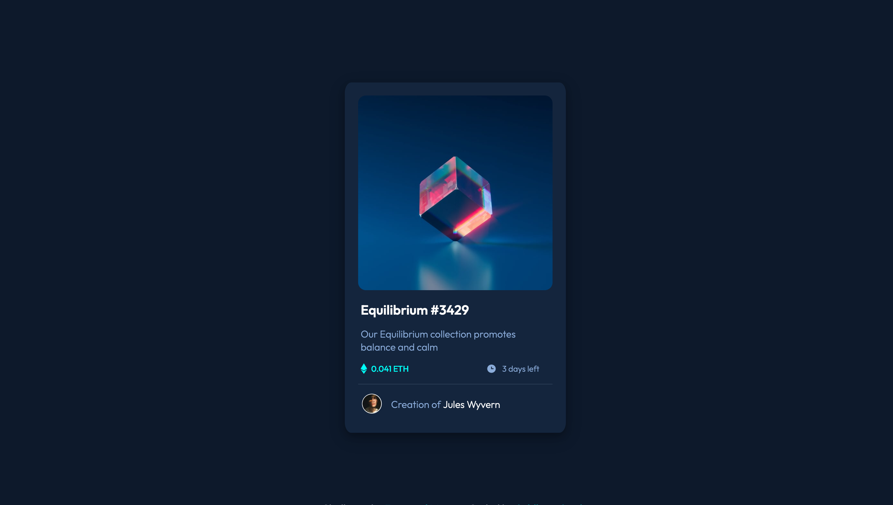

# Frontend Mentor - NFT preview card component solution

This is a solution to the [NFT preview card component challenge on Frontend Mentor](https://www.frontendmentor.io/challenges/nft-preview-card-component-SbdUL_w0U).

## Table of contents

- [Overview](#overview)
  - [The challenge](#the-challenge)
  - [Screenshot](#screenshot)
  - [Links](#links)
- [My process](#my-process)
  - [Built with](#built-with)
  - [What I learned](#what-i-learned)
  - [Useful resources](#useful-resources)
- [Author](#author)

**Note: Delete this note and update the table of contents based on what sections you keep.**

## Overview

### The challenge

Users should be able to:

- View the optimal layout depending on their device's screen size
- See hover states for interactive elements

### Screenshot



### Links

- Solution URL: [Github Repo](https://github.com/siddhantsingh-1/nft-preview-card-component)
- Live Site URL: [Live site](https://siddhantsingh-1.github.io/nft-preview-card-component/)

## My process

### Built with

- Semantic HTML5 markup
- Sass Preprocessor
- Flexbox
- Mobile-first workflow

### What I learned

The most exciting thing about this project was the overlay effect on the equilibrium image.

```html
<figure>
	
	<div class="overlay">
		
	</div>
</figure>
```

```css
figure {
	.overlay {
		position: absolute;
		top: 0;
		width: 100%;
		height: 100%;
		display: flex;
		justify-content: center;
		align-items: center;

		img {
			width: 1.7rem;
			z-index: 2;
			opacity: 0;
			@include transition-ease;
		}
	}

	&::after {
		content: "";
		position: absolute;
		background-color: $cyan;
		top: 0;
		left: 0;
		width: 100%;
		height: 98%;
		border-radius: 4%;
		opacity: 0;
		z-index: 1;
		@include transition-ease;
	}

	&:hover {
		img,
		&::after {
			cursor: pointer;
		}

		img {
			opacity: 1;
		}

		&::after {
			opacity: 0.7;
		}
	}
}
```

### Useful resources

- [Freecodecamp Sass Tutorial](https://www.youtube.com/watch?v=_a5j7KoflTs&t=6075s) - This helped me a lot for learning Sass fundamentals and also the overlay effect that I was able to add. I really liked this pattern and will use it going forward.

## Author

- Website - [Siddhant Singh](https://www.github.com/siddhantsingh-1)
- Frontend Mentor - [@@siddhantsingh-1](https://www.frontendmentor.io/profile/siddhantsingh-1)
- LinkedIn - [@siddhant101](https://www.linkedin.com/in/siddhant101/)
